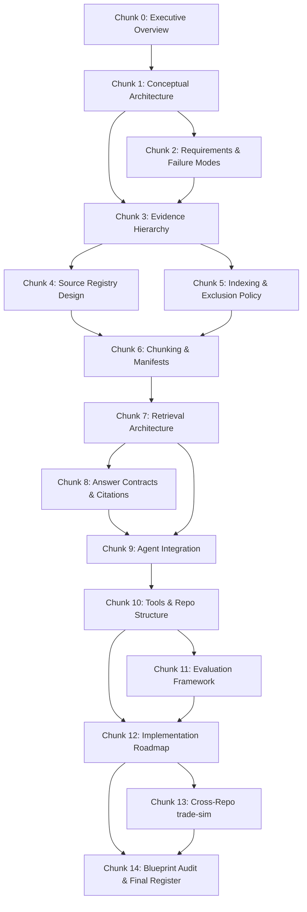

# AOS RAG Blueprint — Chunk 0: Executive Overview and Blueprint Map

---

## 0.1 — Architectural Thesis

**AOS RAG is not a knowledge base. AOS RAG is an evidence authority layer.**

This thesis governs every decision in this blueprint. It is not decoration. It is load-bearing.

The central question AOS RAG answers is not:

> "What documents are semantically similar to this query?"

The central question is:

> "What source is authoritative enough to support this claim?"

AOS already operates on a discipline that most AI-adjacent systems lack: the artifact lifecycle. Artifacts are produced, reviewed, revised, audited, committed, and closed. The lifecycle has rules. Closed loops stay closed. Drafts are not evidence. Notes are not proof. Claims require artifact support.

RAG must serve this discipline. It must not undermine it. If RAG destabilizes closure, weakens evidence standards, or allows unsupported claims to pass as grounded answers, RAG has failed — regardless of retrieval quality.

The system being designed here is:

- **Source-governed retrieval** — not document chat
- **Evidence hierarchy enforcement** — not flat vector search
- **Claim-aware answer contracts** — not open-ended generation
- **Closure protection** — not loop reopening
- **Career-claim calibration** — not resume inflation
- **Citation protocol** — not vague attribution
- **Privacy-safe indexing** — not bulk ingestion

RAG in AOS is a governance layer that happens to use retrieval. Not a retrieval layer that hopes for governance.

---

## 0.2 — What AOS RAG Is

AOS RAG is the evidence authority subsystem of the Analytical Operating System. It exists to:

1. **Ground agent answers in source evidence.** Every AOS agent answer about repo state, artifact status, closure, career claims, or portfolio evidence must cite real sources. RAG provides the retrieval and citation machinery to make this enforceable.

2. **Enforce source authority hierarchy.** Not all sources are equal. A PASS audit outranks a brainstorm. A closed artifact outranks a draft. A committed review outranks a speculative plan. RAG must know this and act accordingly.

3. **Protect closure discipline.** AOS has proven closed loops — AI Writing DAG, Quant Lesson 1, AOS Proven Loop Pattern #1, public-release cleanup, frontend truthfulness cleanup. RAG must never reopen a closed loop unless a real defect exists. Retrieval must respect closure status.

4. **Calibrate career and portfolio claims.** AOS exists partly to produce honest, evidence-backed career claims. RAG must know which artifacts support which claims, what evidence is missing, what the overclaiming risk is, and what safer wording looks like.

5. **Refuse unsupported answers.** When evidence is missing, RAG must say so. When a claim cannot be supported, RAG must refuse. When a source is stale, RAG must flag it. Silence or fabrication is a system failure.

6. **Maintain privacy boundaries.** Learner-state, chat logs, local debugger prompts, provider topology, quarantine outputs, `.hermes/`, `.obsidian/`, `copy-paste/`, `.env*`, and personal scratch files must never be indexed. RAG must enforce this boundary structurally, not by policy alone.

7. **Start with metadata and keyword retrieval.** Embeddings come later. The first retrieval layer is the source registry (metadata), the second is keyword/BM25, the third is exact-match boosting. Vector search is Phase 9. This is not arbitrary conservatism — it is architectural discipline. You cannot evaluate embedding quality until you know what authority looks like.

8. **Produce a source registry as its first deliverable.** Before any retrieval runs, AOS must have a registry of what exists, what tier it occupies, what its status is, what it can support, and what should not be indexed. The registry is the first product.

---

## 0.3 — What AOS RAG Is Not

AOS RAG is **not**:

| Anti-pattern | Why it is excluded |
|---|---|
| A NotebookLM clone | AOS is not a notebook. It is an operating system with governance rules. Scoped containers and source control from NotebookLM are useful *patterns*; the product is not. |
| A SurfSense clone | AOS is local-first, single-repo, privacy-constrained. Multi-surface connectors and external search are later phases at best. |
| A "chat with my docs" interface | The goal is not conversational document access. The goal is evidence-grounded claim governance. |
| A vector database side quest | Embeddings are Phase 9. The system must prove metadata and keyword retrieval work before vectors are introduced. |
| A chatbot | The UI is the last thing built. Answer contracts, citation protocols, and evidence hierarchy come first. |
| A multi-agent sprawl project | AOS already has defined agent roles. RAG integrates with them. It does not spawn new agents. |
| An external connector ecosystem | v0.1 indexes the AOS repo only. No external APIs, no web scraping, no third-party integrations. |
| A reason to index private material | Learner-state, chat logs, local debugger files, provider topology, and personal notes are excluded. Period. |
| A reason to reopen closed loops | Closed loops stay closed unless a real defect is found. RAG must protect this. |
| A reason to build infrastructure first | The source registry is a JSON file. The first retrieval is keyword matching. Start small. Prove value. Then invest. |

---

## 0.4 — System Goals

These are the goals AOS RAG must achieve, ordered by priority:

### Priority 1 — Evidence Governance (Now)

| # | Goal | Deliverable |
|---|---|---|
| G1 | Source registry exists and is validated | `rag/source_registry.json`, `rag/source_registry.schema.json` |
| G2 | Every AOS source has a tier, status, and visibility | Registry seed with complete metadata |
| G3 | Indexable vs excluded files are structurally defined | Indexing policy document + `.gitignore` alignment |
| G4 | Keyword retrieval works for repo-state queries | `tools/rag/keyword_retriever.py` or `.ps1` |
| G5 | Answer contracts exist for each answer type | `prompts/rag/answer_contracts/` |
| G6 | Citations are required for all grounded answers | Citation protocol in answer contracts |
| G7 | Refusal rules exist for unsupported claims | Refusal protocol in answer contracts |

### Priority 2 — Retrieval Quality (Soon)

| # | Goal | Deliverable |
|---|---|---|
| G8 | Metadata filtering narrows retrieval before search | Metadata filter layer in retrieval pipeline |
| G9 | BM25/keyword search returns ranked candidates | Retrieval engine with authority-aware ranking |
| G10 | Chunks preserve heading context and source relationships | `rag/chunk_manifest.json`, chunking rules |
| G11 | Stale/obsolete sources are penalized | Staleness rules in retrieval ranking |
| G12 | Evaluation framework validates retrieval quality | `evaluations/rag/` test fixtures and runner |

### Priority 3 — Advanced Retrieval (Later)

| # | Goal | Deliverable |
|---|---|---|
| G13 | Embeddings augment keyword retrieval | Vector index over chunks |
| G14 | Hybrid retrieval (keyword + vector + metadata) works | Hybrid retrieval pipeline |
| G15 | Reranking uses evidence tier weights | Reranker with authority weighting |

### Priority 4 — Integration and Extension (Later)

| # | Goal | Deliverable |
|---|---|---|
| G16 | Cross-repo indexing of trade-sim (selected files only) | trade-sim source registry entries |
| G17 | Source-of-truth memo connects AOS and trade-sim | Memo builder tool |
| G18 | Evidence browser UI exists | Minimal evidence browser (not chatbot) |

---

## 0.5 — Anti-Goals

These are things AOS RAG must explicitly **not** pursue:

| # | Anti-Goal | Reason |
|---|---|---|
| AG1 | Index everything | Most repo content is not evidence. Bulk indexing destroys authority signal. |
| AG2 | Build a chatbot first | The chatbot is useless without answer contracts and citation protocols. |
| AG3 | Use vector search before metadata/keyword retrieval works | You cannot evaluate embedding quality without a baseline. |
| AG4 | Index learner-state | Private. Never. |
| AG5 | Index chat logs | Private, ephemeral, not evidence. |
| AG6 | Index `.hermes/`, `.obsidian/`, `copy-paste/` | Tool-internal, private, not evidence. |
| AG7 | Index `audits/quarantine/` | Quarantine exists specifically because these outputs failed. |
| AG8 | Treat drafts as career evidence | A draft is not proof. Only audited artifacts support career claims. |
| AG9 | Let embeddings determine authority | Embeddings find candidates. Metadata determines authority. These are different functions. |
| AG10 | Reopen closed loops via retrieval | If RAG surfaces a closed artifact for modification, it must flag closure status and require a defect justification. |
| AG11 | Build external connectors in v0.1 | Local-first. AOS repo only. External surfaces are Phase 11+. |
| AG12 | Spawn new agents for RAG | RAG integrates with existing agents. No new agent roles in v0.1. |
| AG13 | Add post-commit hooks in v0.1 | Too early. Manual or script-triggered updates only. |
| AG14 | Build a force-directed graph UI | Not the first UI. Not the second UI. Maybe never. |
| AG15 | Claim RAG "solves hallucination" | RAG reduces specific failure modes. It does not solve hallucination. The framing matters. |

---

## 0.6 — Phased Architecture Map

The AOS RAG architecture unfolds in phases. Each phase has a clear entry gate, deliverables, exit criteria, and a "what not to mix in" boundary.

```
Phase 0   ──►  Phase 1   ──►  Phase 2   ──►  Phase 3   ──►  Phase 4
Cleanup        Design         Schema         Seed           Registry
Gate           Doc            Definition     Registry       Reviewer
                                                            Prompt

Phase 5   ──►  Phase 6   ──►  Phase 7   ──►  Phase 8
Keyword        Answer         Claim          Closure
Retrieval      Context        Checker        Guard
               Builder

Phase 9   ──►  Phase 10  ──►  Phase 11  ──►  Phase 12
Embeddings     Evidence       Cross-Repo     Memo
               Browser        trade-sim      Builder
```

### Phase boundaries (summary)

| Phase | Name | Gate | Core Deliverable | Not Mixed In |
|---|---|---|---|---|
| 0 | Cleanup Gate | — | Clean working tree, privacy boundary closed, `.gitignore` current | No RAG code |
| 1 | Design Doc | Phase 0 closed | This blueprint, approved | No implementation |
| 2 | Source Registry Schema | Phase 1 approved | `source_registry.schema.json` | No retrieval code |
| 3 | Seed Registry | Schema validated | `source_registry.seed.json` | No retrieval code |
| 4 | Registry Reviewer Prompt | Seed committed | `prompts/rag/registry_reviewer.md` | No retrieval code |
| 5 | Keyword Retrieval | Registry seeded, reviewed | `tools/rag/keyword_retriever.*` | No embeddings |
| 6 | Answer Context Builder | Keyword retrieval working | `tools/rag/answer_context_builder.*` | No UI |
| 7 | Claim Checker | Answer contracts defined | `tools/rag/claim_checker.*` | No UI |
| 8 | Closure Guard | Claim checker working | `tools/rag/closure_guard.*` | No UI |
| 9 | Embeddings | Phases 5–8 stable | Vector index, hybrid retrieval | No external connectors |
| 10 | Evidence Browser | Hybrid retrieval stable | Minimal browser UI | No chatbot |
| 11 | Cross-Repo trade-sim | AOS RAG v0.1 stable | trade-sim source entries | No new agent roles |
| 12 | Memo Builder | Cross-repo indexing working | Source-of-truth memo tool | — |

> [!IMPORTANT]
> **Phase 0 is a hard gate.** No RAG implementation begins until the current cleanup work is closed: learner-state privacy boundary confirmed, `.gitignore` updated, frontend truthfulness fix committed, line-ending noise cleared, local debugger/provider prompts excluded or sanitized, working tree clean or intentionally scoped.

---

## 0.7 — Deliverable Map

Every phase produces specific, named deliverables. This is the complete map:

### Documents and Schemas

| Deliverable | Phase | Path |
|---|---|---|
| RAG Blueprint (this document) | 1 | `docs/rag/blueprint/` (chunked) |
| Source Registry Schema | 2 | `rag/source_registry.schema.json` |
| Source Registry Seed | 3 | `rag/source_registry.seed.json` |
| Chunk Manifest Schema | 6 | `rag/chunk_manifest.schema.json` |
| Chunk Manifest | 6 | `rag/chunk_manifest.json` |
| Indexing Policy | 5 | `docs/rag/indexing_policy.md` |
| Answer Contracts | 6 | `prompts/rag/answer_contracts/*.md` |
| Evaluation Fixtures | 11 | `evaluations/rag/*.json` |

### Tools

| Deliverable | Phase | Path |
|---|---|---|
| Source Registry Validator | 2 | `tools/rag/validate_registry.*` |
| Source Scanner | 3 | `tools/rag/source_scanner.*` |
| Keyword Retriever | 5 | `tools/rag/keyword_retriever.*` |
| Answer Context Builder | 6 | `tools/rag/answer_context_builder.*` |
| Chunk Builder | 6 | `tools/rag/chunk_builder.*` |
| Claim Checker | 7 | `tools/rag/claim_checker.*` |
| Closure Guard | 8 | `tools/rag/closure_guard.*` |
| Evaluation Runner | 11 | `tools/rag/eval_runner.*` |
| Evidence Browser | 10 | `apps/evidence-browser/` |
| Memo Builder | 12 | `tools/rag/memo_builder.*` |

### Prompts

| Deliverable | Phase | Path |
|---|---|---|
| Registry Reviewer | 4 | `prompts/rag/registry_reviewer.md` |
| RAG-aware agent updates | 9 | `prompts/agents/*.md` (updates) |
| Claim Check Prompt | 7 | `prompts/rag/claim_checker.md` |
| Closure Guard Prompt | 8 | `prompts/rag/closure_guard.md` |

---

## 0.8 — Current AOS Repository Structure (Grounded)

This blueprint is grounded in the actual AOS repository as it exists today. The following structure has been verified:

```
analytical-operating-system/
├── .git/
├── .gitignore
├── .hermes/                    ← EXCLUDED from indexing (tool-internal)
├── .obsidian/                  ← EXCLUDED from indexing (tool-internal)
├── README.md                   ← Tier 3 source
├── AOS-QUICK-REF.md            ← Tier 3 source
├── status.md                   ← Tier 4 source (staleness risk)
├── apps/
│   └── aos-landing/            ← Tier 3 (public frontend, truthfulness-sensitive; generated deps excluded)
├── artifacts/                  ← Tier 1-2 (evidence core)
│   ├── ai-writing-dag/         ← CLOSED loop — Tier 1
│   ├── quant-lesson-1/         ← CLOSED loop — Tier 1
│   ├── aos-proven-loop/        ← CLOSED loop — Tier 1
│   └── ...
├── audits/                     ← Tier 1-2 (authority records)
│   ├── quarantine/             ← EXCLUDED from indexing
│   └── ...
├── chat-logs/                  ← EXCLUDED from indexing (private, ephemeral)
├── copy-paste/                 ← EXCLUDED from indexing (scratch)
├── curriculum/                 ← Tier 2-3 (learning structure)
├── docs/                       ← Tier 3 (documentation)
│   └── rag/                    ← Will host this blueprint
├── evaluations/                ← Tier 2-3 (eval framework)
├── governance/                 ← Tier 2 (system rules)
│   ├── GOVERNANCE.md
│   ├── AGENT_LANES.md
│   ├── AOS_STATUS_RULES.md
│   └── ...
├── handoffs/                   ← Tier 4 (context transfer)
├── learner-state/              ← EXCLUDED from indexing (PRIVATE)
├── modules/                    ← Tier 2 (module definitions)
├── ops/                        ← Tier 3-4 (operational scripts)
├── prompts/                    ← Tier 5 (agent prompts)
│   ├── agents/
│   │   ├── artifact-generator.md
│   │   ├── reviewer.md
│   │   ├── auditor.md
│   │   ├── resume-translator.md
│   │   ├── roadmap-agent.md
│   │   ├── debugger.md
│   │   ├── meridian.md
│   │   ├── aos-architect.md
│   │   ├── context-compressor.md
│   │   ├── frontend-agent.md
│   │   └── security-public-release.md
│   └── rag/                    ← Will host RAG prompts
├── rubrics/                    ← Tier 2 (evaluation criteria)
├── skills/                     ← Tier 3 (skill definitions)
├── templates/                  ← Tier 3 (artifact templates)
└── status.md                   ← Tier 4 (staleness risk)
```

### Key observations from the live repo

1. **Closed loops exist and are proven.** The artifacts directory contains `ai-writing-dag/`, `quant-lesson-1/`, and `aos-proven-loop/` — all closed. RAG must recognize and protect these.

2. **Governance is codified.** `GOVERNANCE.md`, `AGENT_LANES.md`, `AOS_STATUS_RULES.md`, and related files define real rules. These are Tier 2 sources that RAG must respect.

3. **Agent prompts are defined.** Eleven agent prompts exist in `prompts/agents/`. RAG integration (Chunk 9) must update these, not replace them.

4. **Privacy-sensitive directories exist.** `learner-state/`, `chat-logs/`, `.hermes/`, `.obsidian/`, `copy-paste/`, `audits/quarantine/` — all must be structurally excluded from indexing.

5. **Status.md is a staleness risk.** It contains current status but may lag behind actual repo state. RAG must treat it as Tier 4 and flag when live verification is needed.

6. **Frontend exists.** `apps/aos-landing/` is the public-facing documentation site. RAG must distinguish public-safe from private content and exclude generated dependency/build output.

7. **Evaluations directory exists but needs RAG-specific fixtures.** `evaluations/` will host RAG evaluation test sets.

8. **No existing RAG infrastructure.** The repo has no `rag/` directory, no vector indexes, no retrieval tools. This is a clean start. That is an advantage.

---

## 0.9 — How to Read This Blueprint

This blueprint is structured as 15 chunks (0–14), each self-contained but connected. Here is how to read and use them:

### Reading order

The chunks are designed to be read in order. Each chunk builds on decisions from previous chunks. However, any chunk can be re-read independently if you need to review a specific subsystem.

### Dependency graph



### Per-chunk structure

Every chunk includes:
- Technical content tied to AOS (not generic RAG)
- Concrete file names, paths, and artifact names where relevant
- Now / Later / Never distinctions
- Schema or contract examples where called for
- Privacy constraints
- Audit criteria
- What not to build

Every chunk ends with:
- Chunk completion statement
- Coverage summary
- Running decision log (cumulative)
- Unresolved questions
- Next chunk pointer
- Copy/paste continuation prompt

### Why chunking is necessary

This blueprint covers 14 subsystems across architecture, data modeling, retrieval engineering, governance design, agent integration, evaluation, and implementation planning. A single document would be:
- Too large to review coherently
- Too dense to give feedback on specific sections
- Too rigid to allow iterative refinement

Chunking allows you to:
- Review and approve each section before the next is generated
- Ask questions and request changes at each boundary
- Build understanding incrementally
- Catch architectural errors early

---

## 0.10 — How Later Chunks Connect

| Chunk | Depends On | Feeds Into |
|---|---|---|
| 1 — Conceptual Architecture | 0 | 2, 3, 9 |
| 2 — Requirements & Failure Modes | 1 | 3, 7, 8, 11 |
| 3 — Evidence Hierarchy | 1, 2 | 4, 5, 7, 8 |
| 4 — Source Registry Design | 3 | 5, 6, 10, 12 |
| 5 — Indexing & Exclusion Policy | 3, 4 | 6, 10 |
| 6 — Chunking & Manifests | 4, 5 | 7, 10 |
| 7 — Retrieval Architecture | 3, 6 | 8, 9, 10 |
| 8 — Answer Contracts & Citations | 2, 7 | 9, 11 |
| 9 — Agent Integration | 1, 7, 8 | 10, 12 |
| 10 — Tools & Repo Structure | 4, 6, 7, 9 | 11, 12 |
| 11 — Evaluation Framework | 2, 8, 10 | 12 |
| 12 — Implementation Roadmap | 10, 11 | 13, 14 |
| 13 — Cross-Repo trade-sim | 12 | 14 |
| 14 — Blueprint Audit & Final Register | All | — |

---

## 0.11 — First High-Level Decision Register

These are the architectural decisions established in Chunk 0. The register will grow with each chunk.

| # | Decision | Rationale | Status |
|---|---|---|---|
| D1 | RAG is an evidence authority layer, not a knowledge base | AOS is governance-first. Retrieval serves governance. Knowledge base framing leads to wrong priorities (chatbot, vector DB, UI). | **Accepted** |
| D2 | Source registry is the first deliverable | You cannot retrieve against authority you haven't catalogued. The registry defines what exists, what tier it is, what it supports. | **Accepted** |
| D3 | Metadata retrieval before keyword, keyword before embedding | Authority is in metadata. Relevance is in keywords. Similarity is in embeddings. The order matters because each layer validates the next. | **Accepted** |
| D4 | Phase 0 cleanup is a hard gate | RAG built on a dirty working tree with unresolved privacy boundaries will encode the mess. Clean first. | **Accepted** |
| D5 | No external connectors in v0.1 | AOS repo is the only source in v0.1. External complexity is deferred until local governance is proven. | **Accepted** |
| D6 | No chat UI before answer contracts | A chatbot without answer contracts is an ungovernered hallucination surface. Contracts first, UI last. | **Accepted** |
| D7 | Closed loops are protected by default | Retrieval must surface closure status. Reopening requires a defect. This is not a RAG decision — it is an AOS invariant that RAG must enforce. | **Accepted** |
| D8 | Privacy exclusions are structural, not policy | `learner-state/`, `chat-logs/`, `.hermes/`, `.obsidian/`, `copy-paste/`, `audits/quarantine/`, `.env*` are excluded from indexing in code, not just in documentation. | **Accepted** |
| D9 | Embeddings are Phase 9 | Not arbitrary. Metadata and keyword retrieval must be proven, evaluated, and stable before introducing a harder-to-debug retrieval layer. | **Accepted** |
| D10 | trade-sim indexing is deferred to Phase 11 | Cross-repo indexing multiplies complexity. AOS RAG must work locally first. trade-sim integration follows only after v0.1 is stable. | **Accepted** |
| D11 | Drafts cannot support career claims | This is an AOS invariant. RAG must enforce it in answer contracts, claim checkers, and retrieval ranking. | **Accepted** |
| D12 | Negative evidence is reported | If no audit exists, the system says so. If no artifact supports a claim, the system says so. Silence is a failure mode. | **Accepted** |
| D13 | Agent roles are preserved, not expanded | RAG integrates with existing agents (Artifact Generator, Reviewer, Auditor, Resume Translator, etc.). No new agent roles for RAG in v0.1. | **Accepted** |
| D14 | Tools are Python or PowerShell, Windows-compatible | AOS runs on Windows. All tools must work in PowerShell. Python is preferred for complex logic; PowerShell for simple scripting. | **Tentative** |
| D15 | Generated files (indexes, manifests) are `.gitignore`-tracked | Vector indexes and chunk manifests are derived artifacts. They should be regenerable and not committed to git (or committed selectively). | **Tentative** |

---

## Chunk Completed

**Chunk 0 — Executive Overview and Blueprint Map** is complete.

---

## What This Chunk Covered

1. **Architectural thesis**: AOS RAG is an evidence authority layer, not a knowledge base
2. **What AOS RAG is**: 8 core capabilities (source-governed retrieval, evidence hierarchy, claim-aware contracts, closure protection, career calibration, citation protocol, privacy-safe indexing, metadata-first retrieval)
3. **What AOS RAG is not**: 10 anti-patterns explicitly excluded (NotebookLM clone, chatbot, vector DB side quest, etc.)
4. **System goals**: 18 goals across 4 priority tiers with named deliverables and file paths
5. **Anti-goals**: 15 explicit anti-goals with rationale
6. **Phased architecture map**: 13 phases (0–12) with gates, deliverables, and mixing boundaries
7. **Deliverable map**: Complete list of documents, schemas, tools, and prompts with phases and paths
8. **Live repository grounding**: Verified directory structure with source tier annotations
9. **Blueprint reading guide**: Chunk dependency graph, reading order, per-chunk structure
10. **How later chunks connect**: Full dependency matrix
11. **First decision register**: 15 architectural decisions with rationale and status

---

## Running Decision Log

| # | Decision | Rationale | Status |
|---|---|---|---|
| D1 | RAG is evidence authority layer, not knowledge base | Governance-first design | **Accepted** |
| D2 | Source registry is first deliverable | Cannot retrieve against uncatalogued authority | **Accepted** |
| D3 | Metadata → keyword → embedding retrieval order | Each layer validates the next | **Accepted** |
| D4 | Phase 0 cleanup is a hard gate | No RAG on dirty tree | **Accepted** |
| D5 | No external connectors in v0.1 | Local governance first | **Accepted** |
| D6 | No chat UI before answer contracts | Contracts govern the chatbot, not vice versa | **Accepted** |
| D7 | Closed loops protected by default | AOS invariant enforced by RAG | **Accepted** |
| D8 | Privacy exclusions are structural | Code-enforced, not just documented | **Accepted** |
| D9 | Embeddings are Phase 9 | Prove simpler retrieval first | **Accepted** |
| D10 | trade-sim deferred to Phase 11 | Local AOS RAG must work first | **Accepted** |
| D11 | Drafts cannot support career claims | AOS invariant | **Accepted** |
| D12 | Negative evidence is reported | Silence is a failure mode | **Accepted** |
| D13 | Agent roles preserved, not expanded | No new agents for RAG in v0.1 | **Accepted** |
| D14 | Tools are Python/PowerShell, Windows-compatible | AOS runs on Windows | **Tentative** |
| D15 | Generated files are `.gitignore`-tracked | Derived artifacts are regenerable | **Tentative** |

---

## Unresolved Questions or Assumptions

| # | Question / Assumption | Impact | Resolution Target |
|---|---|---|---|
| UQ1 | Is Phase 0 cleanup currently complete? Status.md references ongoing work. | Blocks all RAG implementation | Before Chunk 12 |
| UQ2 | Should `source_registry.seed.json` be committed to git or generated? | Affects git hygiene and versioning strategy | Chunk 4 |
| UQ3 | Python vs PowerShell for primary tooling — user preference? | Affects all tool deliverables | Chunk 10 |
| UQ4 | Should the blueprint itself be committed to `docs/rag/blueprint/`? | Affects where this document lives | Chunk 10 |
| UQ5 | Are there additional closed loops beyond the 5 listed in the prompt? | Affects source registry completeness | Chunk 3–4 |
| UQ6 | What is the current state of `apps/aos-landing/` truthfulness fixes? | Part of Phase 0 gate | Chunk 12 |
| UQ7 | Should `governance/` files be Tier 1 or Tier 2? They define system rules but are not artifacts in the lifecycle sense. | Affects evidence hierarchy | Chunk 3 |

---

## Next Chunk to Request

**Chunk 1 — AOS Conceptual Architecture**

This chunk will detail the AOS lifecycle, source-of-truth logic, artifact authority model, closure rules, review/revision/audit mechanics, career-claim grounding, and how RAG integrates with the operating loop.

---

## Copy/Paste Continuation Prompt

```
Continue the AOS RAG Blueprint with Chunk 1 — AOS Conceptual Architecture.

Continue the same blueprint started in Chunk 0.

Preserve and update the running decision log from Chunk 0.

Do not repeat Chunk 0 content except for brief continuity references.

Chunk 1 must include:
- AOS lifecycle
- source-of-truth logic
- artifact authority
- closure rules
- review/revision/audit logic
- career-claim grounding
- how RAG fits into the operating loop
- how RAG protects closure
- how RAG prevents unsupported claims
- how RAG distinguishes notes, drafts, artifacts, reviews, audits, and committed evidence

Stop after completing Chunk 1 and provide all required chunk-ending sections:
- Chunk completed
- What this chunk covered
- Running decision log (updated)
- Unresolved questions or assumptions
- Next chunk to request
- Copy/paste continuation prompt for Chunk 2
```
