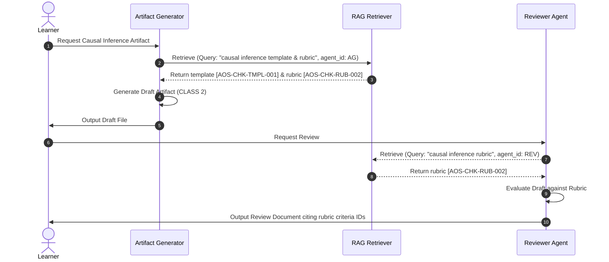
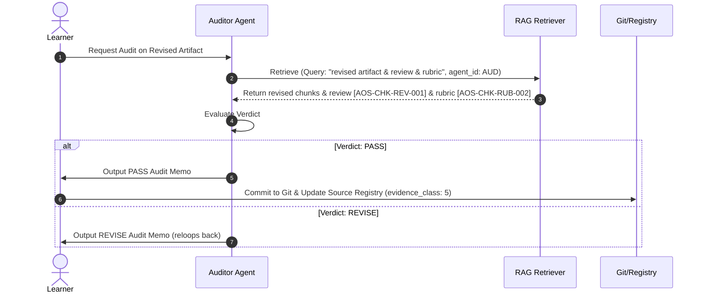
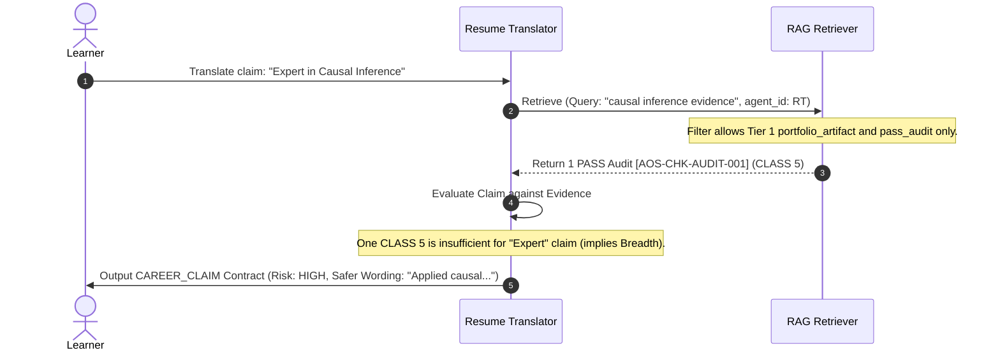

# AOS RAG Blueprint — Chunk 9: Agent Integration and Ecology Modifications

---

> **Continuity from Chunks 0–8**: Chunk 0 established the system goals. Chunk 1 described the lifecycle. Chunk 2 cataloged failure modes. Chunk 3 mapped authority tiers. Chunk 4 designed the registry. Chunk 5 defined directory exclusions. Chunk 6 defined the chunk manifest. Chunk 7 specified retrieval ranking. Chunk 8 codified answer contracts and citation rules. Chunk 9 now integrates the retrieval pipeline into the 11 existing AOS agents, ensuring lane discipline and preventing self-auditing.

---

## 9.0 — RAG in the Agent Ecology

AOS RAG is not a standalone assistant. It is a shared infrastructure layer. Agents do not bypass RAG, nor does RAG act as an independent agent.

Instead, RAG acts as a **system tool** equipped to the agents. When an agent requires context (e.g., the Resume Translator verifying a skill, or the Reviewer retrieving a rubric), it invokes the retrieval tool. The tool returns structured, metadata-wrapped chunks, and the agent's prompt forces it to synthesize this context under the strict rules of the **Answer Contracts (Chunk 8)**.

---

## 9.1 — Agent Prompt Modifications

To support RAG integration, the eleven agent files in `prompts/agents/` must be appended with specific RAG behavioral directives.

### 1. Artifact Generator (`artifact-generator.md`)
- **Integration**: Must query RAG for templates, rubric criteria, and prerequisite lessons before generating text.
- **Directives**:
  - *“You must request the target rubric via the RAG retriever tool using the rubric name. You are forbidden from retrieving prior audits of your own draft work, preventing self-grading loops.”*
  - *“Cite templates using `[AOS-CHK-TMPL-...]` to verify structural compliance.”*

### 2. Reviewer (`reviewer.md`)
- **Integration**: Retrieves the rubric chunks and the target draft artifact.
- **Directives**:
  - *“For every feedback point, you must cite the specific rubric criterion ID (e.g., `[AOS-CHK-RUB-001-002]`) that governs the rule. Uncited critique is invalid.”*

### 3. Auditor (`auditor.md`)
- **Integration**: Retrieves the rubric, revised artifact chunks, and previous reviews.
- **Directives**:
  - *“Your final audit verdict (PASS/REVISE/REJECT) must explicitly list the evidence chain of citable chunks. If issuing a PASS verdict, verify that every rubric criterion chunk has a corresponding PASS validation in the artifact.”*

### 4. Resume Translator (`resume-translator.md`)
- **Integration**: Queries RAG for CLASS 5 (PASS Audit) or CLASS 6 (Closed Loop) sources matching the career domain.
- **Directives**:
  - *“You are strictly forbidden from writing a resume skill bullet unless you retrieve and cite a CLASS 5+ artifact. If only CLASS 2 (Draft) sources are retrieved, you must output a Refusal Block.”*
  - *“Apply the CAREER_CLAIM Answer Contract to all outputs.”*

### 5. Roadmap Agent (`roadmap-agent.md`)
- **Integration**: Queries the module index (`AOS-SRC-MOD-001`) and curriculum files.
- **Directives**:
  - *“Verify prerequisite completion by running a status search on required modules. Do not suggest advanced lessons until prerequisite audits are citable in the evidence chain.”*

### 6. Debugger (`debugger.md`)
- **Integration**: Queries RAG for ops scripts, error logs, and technical documentation.
- **Directives**:
  - *“Ensure all technical recommendations are anchored in current ops scripts (`[AOS-CHK-OPS-...]`). Do not assume deprecated commands work.”*

### 7. MERIDIAN (`meridian.md`)
- **Integration**: Synthesizes multi-domain evidence and resolves source conflicts.
- **Directives**:
  - *“When two retrieved sources conflict, apply the Conflict Resolution Rules: Tier > Recency. Cite both sources, explain the resolution, and detail the confidence impact in your output.”*

### 8. AOS Architect (`aos-architect.md`)
- **Integration**: Queries RAG for governance files and architecture blueprints.
- **Directives**:
  - *“Ensure all architecture changes are trace-linked to the system goals defined in the blueprint (`[AOS-CHK-DOC-...]`).”*

### 9. Context Compressor (`context-compressor.md`)
- **Integration**: Summarizes active session context.
- **Directives**:
  - *“Retain citable chunk IDs in the compressed output. Do not summarize away citation tokens.”*

### 10. Frontend Agent (`frontend-agent.md`)
- **Integration**: Compiles public documentation sites.
- **Directives**:
  - *“Enforce the `visibility: "public"` filter during retrieval. Do not write internal review comments or private files to the static documentation folder.”*

### 11. Security/Public Release (`security-public-release.md`)
- **Integration**: Audits files before public committing.
- **Directives**:
  - *“Scan git diffs for files flagged as private or excluded. Verify that no private learner-state hashes are committed to public logs.”*

---

## 9.2 — Enforcing Lane Boundaries at Query-Time (Controls C-38/C-39)

To prevent **FM-12 (Agent Lane Violation via Retrieval)**, the RAG API wrapper enforces an **Agent Access Control Matrix**. When an agent invokes the retriever, it must pass its unique `agent_id` parameter. The retriever filters the candidate chunks before executing search:

```
            Agent Tool Call (Query, Agent_ID)
                           │
                           ▼
              Look up Agent permissions
                           │
                           ▼
          Filter Chunk Manifest by Allowed Types ──► Omit Forbidden Types
                           │
                           ▼
                Execute BM25 Keyword Search
```

### Agent Access Control Matrix

| Calling Agent | Allowed Source Types | Forbidden Source Types |
|---|---|---|
| **Artifact Generator** | `rubric`, `module_definition`, `template`, `documentation` | `pass_audit` (prevents self-grading) |
| **Reviewer** | `rubric`, `draft_artifact`, `template` | `pass_audit` (prevents bias) |
| **Auditor** | `rubric`, `draft_artifact`, `review`, `pass_audit` | None |
| **Resume Translator** | `portfolio_artifact`, `audited_project`, `pass_audit` | `draft_artifact`, `prompt` (prevents overclaiming) |
| **Roadmap Agent** | `module_definition`, `curriculum`, `status_file` | `pass_audit` content, `review` content (metadata-only) |
| **Debugger** | `ops_script`, `documentation` | `pass_audit`, `review` |

---

## 9.3 — Ecological Workflow Sequence Diagrams

### 9.3.1 — RAG-Assisted Generation and Review



### 9.3.2 — Audit and Closure



### 9.3.3 — Resume Translation and Verification



---

## 9.4 — Context Injection Prompt Pattern

When the retriever compiles citable chunks for injection into an agent's prompt, it formats the block using the following structure:

```markdown
---
START OF CITABLE CONTEXT BLOCK
The following chunks are retrieved citable contexts. You must adhere to the citation protocol and citation validation rules. If you reference a fact, you must append the corresponding [AOS-CHK-*] token to the clause.

=== CHUNK 1 ===
ID: AOS-CHK-RUB-002-001
Source ID: AOS-SRC-RUB-002
File Path: rubrics/causal_reasoning_quality.md
Evidence Class: N/A (Structural)
Tier: 2
Content:
[BREADCRUMBS: Causal Reasoning Rubric > 1. Identification Strategy]
An acceptable identification strategy must define the target estimand and map all variables to a structural DAG...

=== CHUNK 2 ===
ID: AOS-CHK-AUDIT-001-002
Source ID: AOS-SRC-AUDIT-001
File Path: audits/semantic/ai_writing_assistant_memo_case_study.repair_audit_2026-05-25.md
Evidence Class: 5 (Audited-PASS)
Tier: 1
Content:
[BREADCRUMBS: Repair Audit > Verdict Details]
The revised statistical plan successfully resolved the selection bias issues identified in the previous review...

END OF CITABLE CONTEXT BLOCK
---
```

---

## 9.5 — What Not to Change in v0.1 Prompts

### Constraints:
- **Reasoning personae**: Do not alter the core behavioral traits, reasoning styles, or conversational personas of the 11 agents.
- **RAG Appends Only**: RAG instructions must be appended as isolated instruction blocks at the end of the existing prompt markdown files. This ensures that agent modifications are cleanly trackable and easy to rollback.

---

## Chunk Completed

**Chunk 9 — Agent Integration and Ecology Modifications** is complete.

---

## What This Chunk Covered

1. **RAG Integration Roles**: Configured RAG as a utility tool inside the 11-agent AOS ecology.
2. **Specific Prompt Directives**: Outlined markdown adjustments for the 11 prompts.
3. **Query-Time Access Control (Control C-38/C-39)**: Implemented the access control matrix to enforce agent lane discipline.
4. **Sequence Diagrams**: Modeled workflows for Generation/Review, Audit/Closure, and Resume Translation pipelines.
5. **Context Injection Format**: Specified the prompt injection wrapper for citable chunks.
6. **Prompt Integrity**: Enforced append-only prompt edits to preserve core agent behaviors.

---

## Running Decision Log

*All decisions from Chunks 0–8 (D1–D80) are preserved. New decisions from Chunk 9:*

| # | Decision | Rationale | Status |
|---|---|---|---|
| D1–D80 | *(preserved from Chunks 0–8)* | | |
| D91 | RAG is a utility tool, not an autonomous agent | Keeps the agent ecology simple. Prevents conversational overhead between agents. | **Accepted** |
| D92 | Query-time Agent Access Control filters chunk manifest | Ensures agents cannot read files outside their lane, preserving evaluation objectivity. | **Accepted** |
| D93 | Artifact Generator is blocked from reading audits of its target work | Prevents generator agents from "teaching to the test" or copying audit responses. | **Accepted** |
| D94 | Reviewer must cite rubric criteria chunks for critique | Prevents opinionated or subjective reviews. Grounding must be explicit. | **Accepted** |
| D95 | Auditor must map PASS verdicts to citable rubric criteria | Anchors the audit verdict to verified sections of the artifact file. | **Accepted** |
| D96 | Resume Translator must verify claims using PASS audits/Closed loops | Prevents overclaiming at the translator layer. Enforces Career Claim Contracts. | **Accepted** |
| D97 | Dynamic context injection blocks formatting variations | Standardizes citable blocks, making it easier for local parsers to check references. | **Accepted** |
| D98 | Prompt modifications are strictly append-only | Minimizes risk of regression in existing agent reasoning modules. | **Accepted** |
| D99 | Roadmap agent prerequisite check uses citable audit metadata | Ensures structural tracking of learner pathways is verified rather than assumed. | **Accepted** |
| D100| Excluded files are hard-blocked at the access control wrapper | Double-layer protection: pre-indexing excludes them, and query access matrices reject them. | **Accepted** |

---

## Unresolved Questions or Assumptions

| # | Question / Assumption | Impact | Resolution Target |
|---|---|---|---|
| UQ1 | Is Phase 0 cleanup currently complete? | Blocks all RAG implementation | Before Chunk 12 |
| UQ3 | Python vs PowerShell for primary tooling? | Affects all tools | Chunk 10 |
| UQ4 | Should the blueprint itself be committed to `docs/rag/blueprint/`? | Affects document location | Chunk 10 |
| UQ6 | What is the current state of `apps/aos-landing/` truthfulness fixes? | Part of Phase 0 gate | Chunk 12 |
| UQ12 | Should the control register be a trackable repo file? | Affects governance traceability | Chunk 10 |
| UQ13 | How should FM-08 (phantom citations) be tested? | Affects evaluation framework | Chunk 11 |
| UQ16 | Should the Quant Lesson 1 closure be formalized with an audit record, or documented as an informal closure? | Affects evidence chain completeness | Before Phase 3 seed finalization |

---

## Next Chunk to Request

**Chunk 10 — Tooling and Repository Structure**

This chunk will define the exact file system paths for all new RAG scripts and configuration files, outline the architecture of the RAG command-line interface, establish the scripting language preference (resolving UQ3), document where this blueprint will reside (resolving UQ4), and determine if the control register should be committed as a tracked file (resolving UQ12).

---

## Copy/Paste Continuation Prompt

```
Continue the AOS RAG Blueprint with Chunk 10 — Tooling and Repository Structure.

Continue the same blueprint started in Chunk 0, continued through Chunks 1–9.

Preserve and update the running decision log from Chunks 0–9 (D1–D100).

Do not repeat Chunks 0–9 content except for brief continuity references.

Chunk 10 must include:
- exact folder structures and paths for RAG tools
- script-level design (Python vs PowerShell - resolving UQ3)
- CLI design and available parameters (validate-registry, rebuild-index, query-rag)
- registry location and path within the repo (resolving UQ4)
- control register serialization format (resolving UQ12)
- validation script workflows
- error handling, output log locations, and local caching
- what not to build in v0.1 tooling

Stop after completing Chunk 10 and provide all required chunk-ending sections:
- Chunk completed
- What this chunk covered
- Running decision log (updated)
- Unresolved questions or assumptions
- Next chunk to request
- Copy/paste continuation prompt for Chunk 11
```
